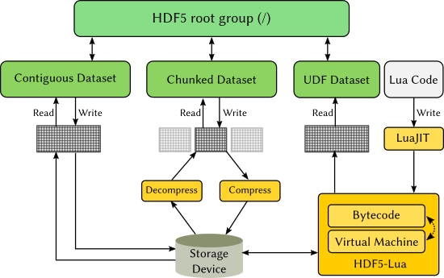

# HDF5-UDF

HDF5-UDF is a mechanism to dynamically generate HDF5 datasets through
user-defined functions (UDFs) written in Lua, Python, or C/C++.

User-defined functions are compiled into executable form and the result
is embedded into HDF5. A supporting library gives access to existing datasets
from user code so that data analysis and derivation of other data can be produced.

Access to HDF5 is made through Foreign Function Interfaces (FFIs) in Python and
Lua, meaning that there is no measurable overhead when accessing input and output
datasets from such languages. UDFs written in C/C++ are compiled into shared libraries,
compressed, and embedded into HDF5 just like in the Python and Lua backends. The
difference is that, unlike a LuaJIT bytecode, for instance, shared libraries are
compiled to the target architecture, hence are not as portable.

The Lua, C/C++, and Python APIs are identical and provide the following simple
functions to interface with HDF5 datasets:

- `lib.getData("DatasetName")`: fetches DatasetName from the HDF5
   file and loads it into memory
- `lib.getDims("DatasetName")`: number of dimensions in DatasetName
   and their sizes
- `lib.getType("DatasetName")`: dataset type of DatasetName. See
   below for a list of supported dataset types.

The user-provided function must be named `dynamic_dataset`. That
function takes no input and produces no output; data exchange is
performed by reading from and writing to the datasets retrieved
by the API above. See the next section for examples on how to
get started with UDF scripts.

There is no difference between accessing a dataset that has been
dynamically generated and a regular one. As shown in the image
below, both are retrieved using the existing HDF5 API. Note that
differently from a regular HDF5 dataset (where the actual grid is
stored on disk), HDF5-UDF datasets require only the bytecode (or
compressed shared library) to persist on disk.



## Supported dataset types

The following dataset types map to their corresponding little-endian
definitions in HDF5:

- `int8` (`H5T_STD_I8LE`)
- `int16` (`H5T_STD_I16LE`)
- `int32` (`H5T_STD_I32LE`)
- `int64` (`H5T_STD_I64LE`)
- `uint8` (`H5T_STD_U8LE`)
- `uint16` (`H5T_STD_U16LE`)
- `uint32` (`H5T_STD_U32LE`)
- `uint64` (`H5T_STD_U64LE`)
- `float` (`H5T_IEEE_F32LE`)
- `double` (`H5T_IEEE_F64LE`)

# Examples

When `hdf5-udf` is executed with the user-provided Lua file as input, it
scans the code for calls to `lib.getData()` to identify dataset names.
Names that map to existing datasets in the input file will cause the
corresponding datasets to be opened in read-only mode. Names that don't
relate to existing datasets will be dynamically generated by executing
the provided Lua file (in bytecode form) each time the dataset is read.

The following are simple examples that should get you started into writing
your own functions. More examples are given in the "examples" directory of
this project.

## Declare a dynamic dataset "C" as the sum of datasets "A" and "B"
```
function dynamic_dataset()
    local a_data = lib.getData("A")
    local b_data = lib.getData("B")
    local c_data = lib.getData("C")
    local n = lib.getDims("C")[1] * lib.getDims("C")[2]
    for i=0, n-1 do
        c_data[i] = a_data[i] + b_data[i]
    end
end
```

## Same user-defined-function as before, but written in Python
```
def dynamic_dataset():
    a_data = lib.getData("A")
    b_data = lib.getData("B")
    c_data = lib.getData("C")
    n = lib.getDims("C")[0] * lib.getDims("C")[1]

    for i in range(n):
        c_data[i] = a_data[i] + b_data[i]
```

## Same user-defined-function as before, but written in C++
```
extern "C" void dynamic_dataset()
{
    auto a_data = lib.getData<int>("A");
    auto b_data = lib.getData<int>("B");
    auto c_data = lib.getData<int>("C");
    auto n = lib.getDims("C")[0] * lib.getDims("C")[1];

    for (size_t i=0; i<n; ++i)
        c_data[i] = a_data[i] + b_data[i];
}
```

## Declare dynamic datasets "B" and "C" as variations of dataset "A"
```
function dynamic_dataset()
    local a_data = lib.getData("A")
    local b_data = lib.getData("B")
    local c_data = lib.getData("C")
    local x = lib.getDims("A")[1]
    local y = lib.getDims("A")[2]
    for i=0, x-1 do
        for j=0, y-1 do
            b_data[i*y+j] = a_data[i*y+j] * 2
            c_data[i*y+j] = a_data[i*y+j] * 3
        end
    end
end
```

## Other examples

The [examples](https://github.com/lucasvr/hdf5-udf/tree/master/examples)
directory holds a collection of scripts that can be readily compiled and tested.
Please refer to their source code for build instructions and further details.

Also, make sure to read the template files for
[Lua](https://github.com/lucasvr/hdf5-udf/blob/master/src/udf_template.lua),
[Python](https://github.com/lucasvr/hdf5-udf/blob/master/src/udf_template.py), and
[C/C++](https://github.com/lucasvr/hdf5-udf/blob/master/src/udf_template.cpp)
to learn more about the APIs behind the `lib` interface.


# Configuration and execution

If the program has been installed to a directory other than `/usr/local`, then
make sure to configure the HDF5 filter search path accordingly:

```
$ export HDF5_PLUGIN_PATH=/installation/path/hdf5/lib/plugin
```

The main program takes as input a few required arguments: the HDF5 file, the
user-defined Lua script, and the output dataset name/resolution/data type. If
we were to create a `float` dataset named "temperature" with 1000x800 cells
(and whose Lua script is named "udf.lua") then the following command would do
it (while appending the result to "myfile.h5"):

```
$ hdf5-udf myfile.h5 udf.lua temperature:1000x800:float
```

It is also possible to let the main program infer the output dataset information
based on the Lua script -- as long as the script takes input from at least one
existing dataset. In that case, if the dataset name/resolution/data type is
omitted from the command line, the main program:

1. Identifies calls to `lib.getData()` in the Lua script and checks if the dataset
   name given as argument to that function exists in the HDF5 file. If it doesn't,
   then that name is used for the output dataset.
2. Identifies the resolution and data types of existing datasets taken as input.
   If all input datasets have the same resolution and data type, then the output
   dataset is produced with the same characteristics.

In such cases, invoking the program is as simple as:

```
$ hdf5-udf myfile.h5 udf.lua
```

Last, but not least, it is possible to have more than one dataset produced by
a single user-defined function. In that case, information regarding each output
variable can be provided in the command line as extra arguments to the main
program. Alternatively, their names, resolution and data types can be guessed
from the Lua script as mentioned above.
