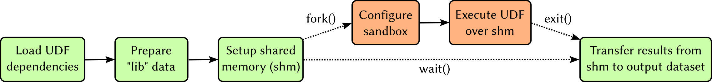

# Security considerations

Trusting user-defined functions to execute arbitrary code on someone else's
computer is always complicated. All is fine until some malicious piece of code
decides to explore the filesystem and mess around with system resources and
sensitive data. This is such an important topic that several projects delegate
dedicated teams to reduce the attack surface of components that execute code
from external parties.

Because users cannot tell in advance what a certain user-defined function is
about to do, HDF5-UDF uses a few mechanisms to limit what system calls the
UDF can execute.

### Seccomp

We rely on **seccomp** to determine which system calls UDFs are allowed to
invoke -- the UDF process is terminated if it tries to run a function that
does not belong to the allow-list. The following image shows the overall
architecture of our seccomp-based sandboxing.

The basic system calls allowed have to do with dynamic memory allocation,
such as `brk` and `mmap`. It is also possible to use a selected set of
network-related system calls: `socket`, `setsockopt`, `ioctl`,
`connect`, `select`, `poll`, `read`, `recv`, `recvfrom`, `write`, `send`,
`sendto`, `sendmsg`, and `close`.

System-call filtering is easy to handle until we look into handling syscalls
issued by Glibc itself -- such as the `gethostbyname` family of functions.
`gethostbyname` needs to query the DNS server to resolve host names into IP
addresses. Glibc finds that server by `stat`-ing and `open`-ing `/etc/resolv.conf`
on the host filesystem. It also performs calls to `uname`, attempts to access
`/lib/libnss_files.so`, and more. It is possible to configure **seccomp** rules
so that only specific arguments can be provided to the allowed system calls.
However, string-based arguments are not supported by the filters. Consequently,
we have to combine **seccomp** with another mechanism to provide fine-grained
control of filesystem operations.

### Syscall Intercept

**syscall_intercept** is a library developed by Intel that allows one to intercept
system calls issued by the UDF and by Glibc itself. It is possible to catch calls
to e.g., `open` and choose to allow or deny the syscall according to the arguments
provided to the function (including those string-based).

We use **syscall_intercept** on top of **seccomp** to prevent UDFs from accessing 
files not included in a predefined list.
