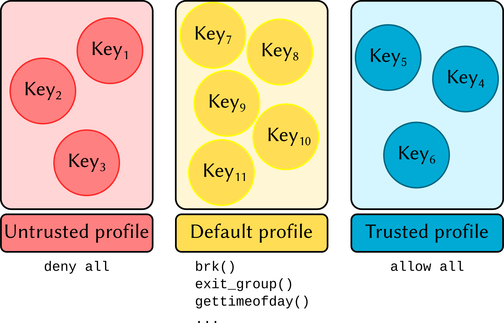

# Security considerations

Trusting user-defined functions to execute arbitrary code on someone else's
computer is always complicated. All is fine until some malicious piece of code
decides to explore the filesystem and mess around with system resources and
sensitive data. This is such an important topic that several projects delegate
dedicated teams to reduce the attack surface of components that execute code
from external parties.

Because users cannot tell in advance what a certain user-defined function is
about to do, HDF5-UDF uses a few mechanisms to limit what system calls the
UDF can execute.

### Seccomp

We rely on **seccomp** to determine which system calls UDFs are allowed to
invoke -- the UDF process is terminated if it tries to run a function that
does not belong to the allow-list. The following image shows the overall
architecture of our seccomp-based sandboxing.

### Trust profiles

Starting with HDF5-UDF 2.0, a private and public key pair is automatically generated
and saved to the user's home directory (under `~/.config/hdf5-udf`) the first time
a dataset is created. The files are named after the currently logged user name:

- `~/.config/hdf5-udf/username.pub`: public key
- `~/.config/hdf5-udf/username.priv` private key
- `~/.config/hdf5-udf/username.meta`: contact information (email and full name,
  manually configured)

A directory structure providing different `trust profiles` is also created. Inside
each profile directory exists a JSON file which states the system calls allowed to
be executed by members of that profile. Three profiles are created:

- **default**: a sane configuration that allows memory allocation, opening files in
  read-only mode, writing to `stdout` and `stderr`, and interfacing with the
  terminal device.
- **deny**: strict settings that simply allow writing to `stdout` and `stderr`.
- **allow**: poses no restrictions. The UDF is treated as a regular process with
  no special requirements.

### Signing UDFs

UDFs are **automatically signed** at the time of their attachment to the HDF5 file.
The public key from `username.pub` and contact information from `username.meta`
are incorporated as metadata and saved next to the UDF bytecode in the HDF5 file.

### Associating UDFs with a trust profile

Self-signed UDFs are automatically placed on the `allow` profile. This means that
UDFs you create on your own machine will run, on that same machine, as a regular
process would.

HDF5 files with UDFs signed by a different user are automatically placed on the
`deny` profile: the public key is extracted from the metadata and saved as
`~/.config/hdf5-udf/deny/foo.pub`. In other words, when you receive a file from
an unknown party and load a UDF dataset, the bytecode will not be able to perform
any actions that require the execution of system calls (other than writing to
`stdout` and `stderr`).

It is possible to change the trust level by simply **moving that public key to a
different profile directory**. The next time a UDF signed by that key is read,
the seccomp rules associated with that profile will be enforced.

### Syscall Intercept

System-call filtering is easy to handle until we look into handling syscalls
issued by Glibc itself -- such as the `gethostbyname` family of functions.
`gethostbyname` needs to query the DNS server to resolve host names into IP
addresses. Glibc finds that server by `stat`-ing and `open`-ing `/etc/resolv.conf`
on the host filesystem. It also performs calls to `uname`, attempts to access
`/lib/libnss_files.so`, and more. It is possible to configure **seccomp** rules
so that only specific arguments can be provided to the allowed system calls.
However, string-based arguments are not supported by the filters. Consequently,
we have to combine **seccomp** with another mechanism to provide fine-grained
control of filesystem operations.

**syscall_intercept** is a library developed by Intel that allows one to intercept
system calls issued by the UDF and by Glibc itself. It is possible to catch calls
to e.g., `open` and choose to allow or deny the syscall according to the arguments
provided to the function (including those string-based).

We use **syscall_intercept** on top of **seccomp** to prevent UDFs from accessing 
files not included in a predefined list.
